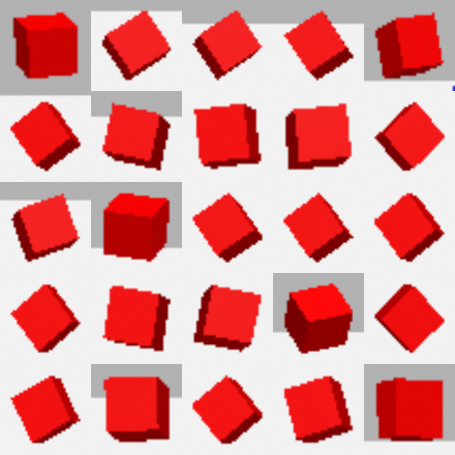

# Self-Supervised Robot Planning (TAMP)

This repository contains the implementation of a Task and Motion Planning (TAMP) framework combined with a self-supervised perception system. The system enables a robotic manipulator to identify, cluster, and manipulate objects within a simulated environment using raw visual data.

## Project Structure

* `src/`: Contains the ROS 2 packages, including the manipulator configuration (`panda_moveit_config`) and the main logic bridging task planning and motion execution (`pytamp_moveit_bridge`).
* `models/`: Stores the trained neural networks and clustering models used by the perception node, such as the SimCLR backbone and K-Means models.
* `dataset/`: Contains the raw and processed images captured from the simulation environment used to train the self-supervised model.

## Features

1. **Self-Supervised Perception:** Extracts visual features from raw camera images using a ResNet backbone trained with SimCLR.
2. **Dynamic Clustering:** Uses K-Means to identify and group distinct objects without relying on manual bounding box annotations.
3. **PDDL Task Planning:** Translates the perceived world state into PDDL problems, solved dynamically using a breadth-first search planner.
4. **Motion Execution:** Leverages MoveIt 2 to calculate and execute the physical trajectories required to accomplish the high-level PDDL plan.

## Clustering Example

Below are sample regions of interest extracted by the perception node and grouped into a distinct cluster by the trained K-Means model. The system accurately isolates features based on color, geometry, and appearance.

## License

This project is licensed under the MIT License. See the LICENSE file for details.
